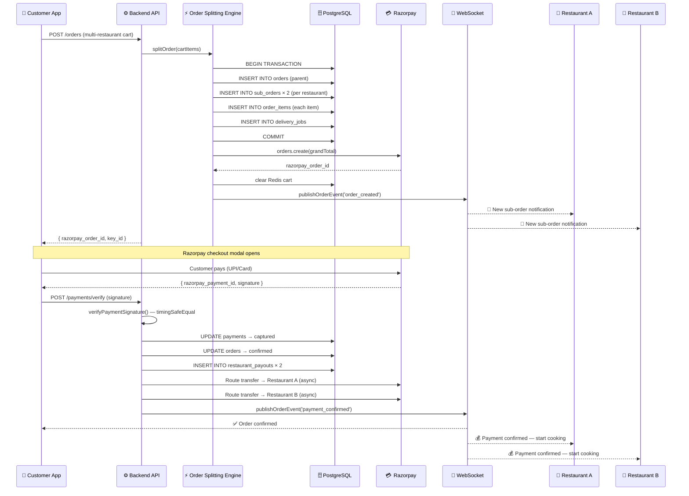
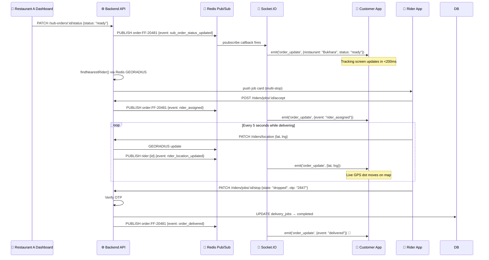
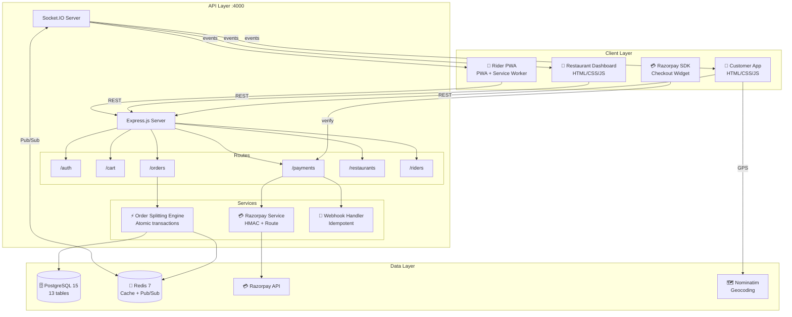
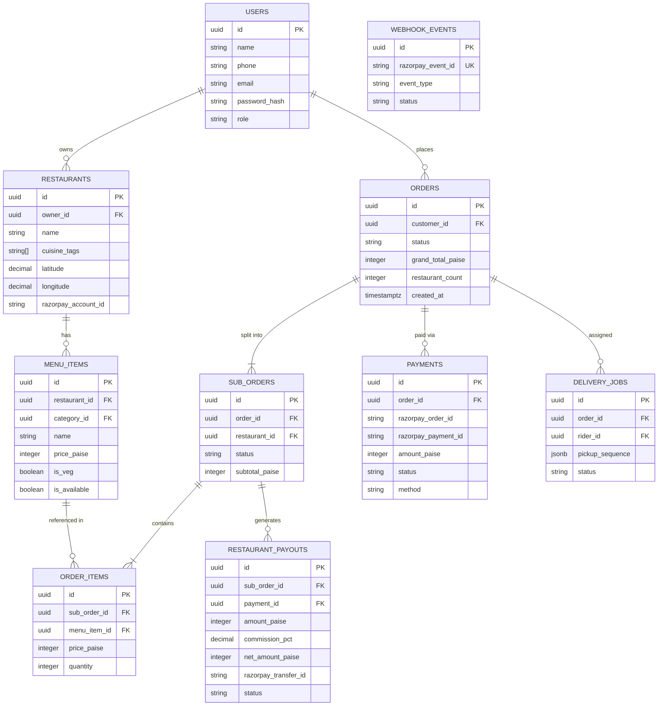

# ForkFleet — Flow Diagrams

Paste any of these into GitHub issues, PRs, or your README.
GitHub renders Mermaid natively in markdown files.

---

## 1. Order Splitting Flow

---

## 2. Real-Time Delivery Tracking

---

## 3. Razorpay Webhook Idempotency

```mermaid
flowchart TD
    RZP[Razorpay Server] -->|POST /payments/webhook| WH[Webhook Handler]
    WH --> SIG{Validate\nHMAC Signature}
    SIG -->|Invalid| R400[Return 400 Bad Request]
    SIG -->|Valid| PARSE[Parse JSON body]
    PARSE --> IDEM{Event already\nin webhook_events?}
    IDEM -->|Yes - duplicate| R200A[Return 200 already_processed]
    IDEM -->|No - new event| DISPATCH[Dispatch to handler]
    DISPATCH --> E1{Event type?}
    E1 -->|payment.captured| H1[handlePaymentCaptured\nconfirmPayment + Route splits]
    E1 -->|payment.failed| H2[handlePaymentFailed\nmark payment failed]
    E1 -->|refund.processed| H3[handleRefundProcessed\nupdate payment status]
    E1 -->|transfer.settled| H4[handleTransferSettled\nmark payout paid]
    H1 & H2 & H3 & H4 --> MARK[INSERT webhook_events\nstatus = processed]
    MARK --> R200B[Return 200 ok]

    style RZP fill:#1a1916,stroke:#f0a020
    style SIG fill:#1a2535,stroke:#e8522a
    style IDEM fill:#1a2535,stroke:#4090e0
    style R400 fill:#2a1a1a,stroke:#dc382d
    style R200A fill:#1a2a1a,stroke:#2ecc71
    style R200B fill:#1a2a1a,stroke:#2ecc71
```

---

## 4. System Component Map

---

## 5. Database Entity Relationships

---

## 6. Revenue Flow

```mermaid
flowchart LR
    C["Customer\npays ₹820"]
    RZP["Razorpay\nprocesses"]
    FF["ForkFleet\nplatform"]
    RA["Restaurant A\ngets paid"]
    RB["Restaurant B\ngets paid"]

    C -->|"₹820\ngrand total"| RZP
    RZP -->|"₹820 captured"| FF
    FF -->|"₹369 net\n(₹430 - 15%)"| RA
    FF -->|"₹310 net\n(₹365 - 15%)"| RB
    FF -->|"₹141 stays\n(commission + delivery)"| FF

    note1["Platform keeps:\n₹123 commission (15%)\n₹60 delivery (2×₹30)\n₹41 GST collected"]

    style C fill:#1a2535,stroke:#4090e0
    style RZP fill:#1a1a0e,stroke:#f0a020
    style FF fill:#2a1508,stroke:#e8522a
    style RA fill:#0e2a1a,stroke:#2ecc71
    style RB fill:#0e2a1a,stroke:#2ecc71
```

